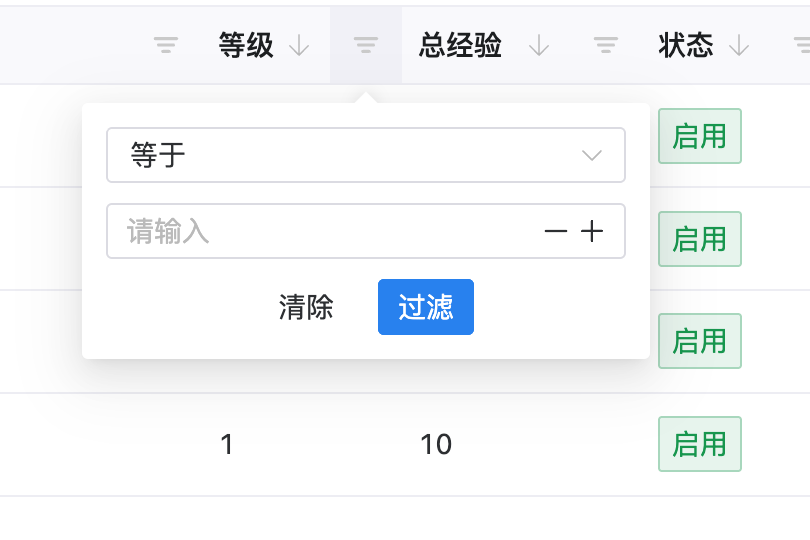
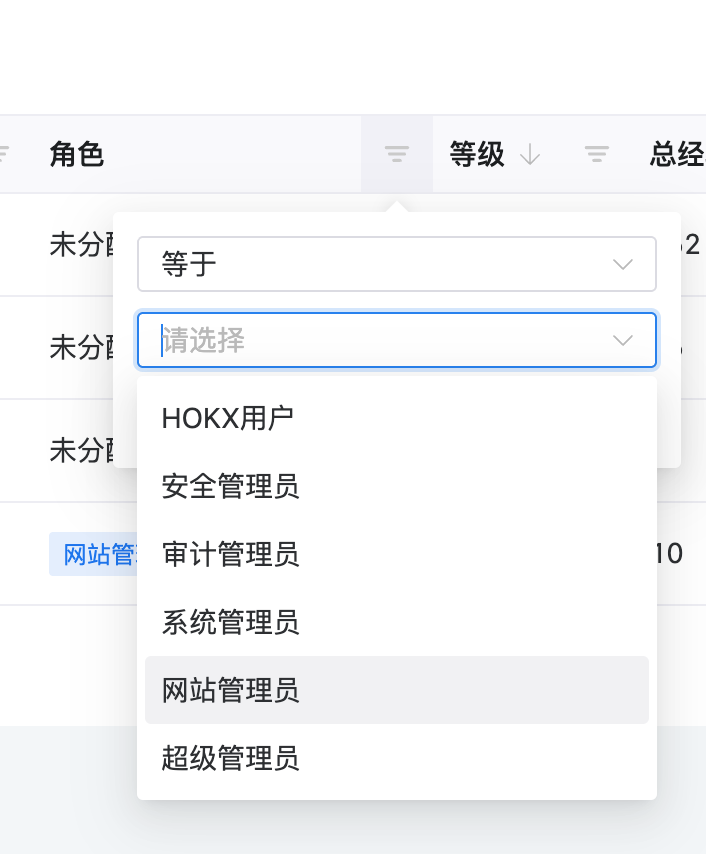
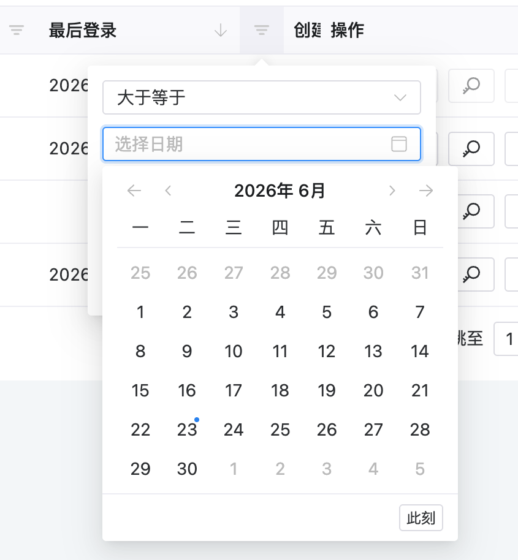
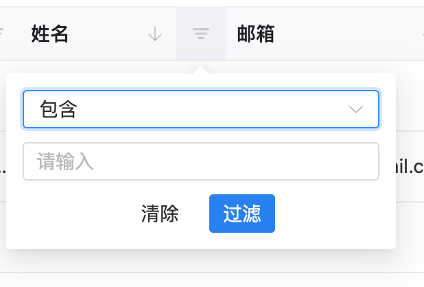

# naive-gridfilter

[English](./README.md) | [简体中文](./README.zh-CN.md)

Config-driven advanced filters for [Naive UI](https://www.naiveui.com/) data tables.

`naive-gridfilter` extracts a reusable version of a production table header filter pattern: you describe each column's filter type in configuration, and the package renders a Naive UI filter menu plus normalized `filterRules` for remote APIs.

## Screenshots

Text filters provide common string operators such as contains, equals, starts with and ends with.



Select filters work with static options or async option loading, which is useful for status, category and owner fields.



Date filters support independent start and end operators, then expand the selected range into backend-friendly rules.



Number filters provide comparison operators for IDs, counters, scores and other numeric columns.



## Install

```bash
npm install naive-gridfilter
```

Peer dependencies:

```bash
npm install vue naive-ui
```

## Basic Usage

```vue
<script setup lang="ts">
import { computed, ref } from 'vue';
import { NDataTable } from 'naive-ui';
import {
  buildFilterRules,
  createFilterColumns,
  type GridFilterState,
} from 'naive-gridfilter';
import 'naive-gridfilter/style.css';

const filters = ref<GridFilterState>({});

const columns = computed(() =>
  createFilterColumns(
    [
      {
        title: 'ID',
        key: 'id',
        sorter: true,
        gridFilter: { type: 'number', minNumber: 1 },
      },
      {
        title: 'Name',
        key: 'name',
        gridFilter: 'text',
      },
      {
        title: 'Status',
        key: 'status',
        gridFilter: {
          type: 'select',
          options: [
            { label: 'Enabled', value: 1 },
            { label: 'Disabled', value: 0 },
          ],
        },
      },
      {
        title: 'Updated At',
        key: 'updated_at',
        gridFilter: { type: 'date' },
      },
    ],
    {
      filters: filters.value,
      onFilterChange(nextFilters, rules) {
        filters.value = nextFilters;
        loadData({ page: 1, filterRules: rules });
      },
    }
  )
);

async function loadData(params = {}) {
  const filterRules = buildFilterRules(filters.value);
  // await api.list({ ...params, filterRules });
}
</script>

<template>
  <n-data-table remote :columns="columns" />
</template>
```

## Column Configuration

Add `gridFilter` to any Naive UI table column:

```ts
const columns = createFilterColumns([
  { title: 'Name', key: 'name', gridFilter: 'text' },
  { title: 'ID', key: 'id', gridFilter: { type: 'number', minNumber: 1 } },
  {
    title: 'Status',
    key: 'status',
    gridFilter: {
      type: 'select',
      options: [
        { label: 'Enabled', value: 1 },
        { label: 'Disabled', value: 0 },
      ],
    },
  },
]);
```

## Output Format

`buildFilterRules()` returns a backend-friendly array:

```ts
[
  { field: 'name', op: 'icontains', ig: false, value: 'Li', type: 'text' },
  { field: 'id', op: 'gte', ig: false, value: 10, type: 'number' },
  { field: 'updated_at', op: 'gte', ig: false, value: '2025-01-02 00:00:00', type: 'date' },
  { field: 'updated_at', op: 'lte', ig: false, value: '2025-01-31 00:00:00', type: 'date' },
];
```

Date range filters expand into two independent rules. `false` and `0` are preserved as valid filter values.

## Filter Types

- `text`: contains, equals, starts with, ends with
- `number`: equals, greater than, greater than or equal, less than, less than or equal
- `date`: start/end date with independent operators
- `select`: static or async options
- `combobox`: searchable select
- `boolean`: true/false select
- `combotree`: multiple tree select, emitted with `in`

## Async Options

```ts
{
  title: 'Owner',
  key: 'owner_id',
  gridFilter: {
    type: 'select',
    async fetchOptions(query) {
      const res = await fetch(`/api/users?q=${query ?? ''}`);
      const users = await res.json();
      return users.map((user) => ({ label: user.name, value: user.id }));
    },
  },
}
```

## Direct Component Usage

```vue
<HeaderFilter
  field-key="name"
  type="text"
  :model-value="filters.name"
  @apply="(filter) => (filters.name = filter)"
/>
```

## Development

```bash
npm install
npm test
npm run typecheck
npm run build
```

## Publishing

```bash
npm publish
```

For scoped public packages, use:

```bash
npm publish --access public
```

## License

MIT
